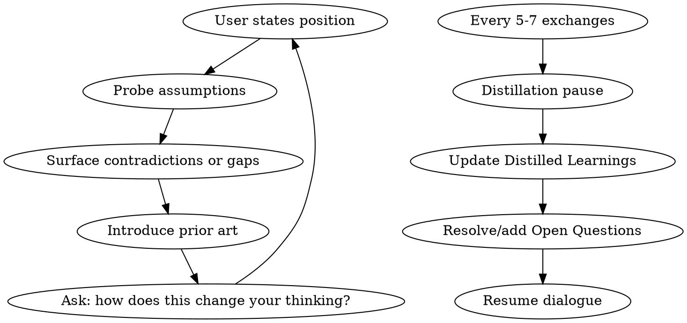

# Discourse — Socratic Research Exploration

Structured bidirectional Q&A that produces durable learning artifacts. You challenge assumptions, proactively surface prior art, and periodically distill raw dialogue into established knowledge.

## Invocation

- `/discourse <topic>` — create new discourse document
- `/discourse --resume <filename>` — resume existing discourse (filename without path, e.g. `fact-catalog`)

## Starting a New Discourse

1. **Create the document** at `/NOTES/discourse/<topic-slug>.md` using the template below
2. **Seed context** — ask the user what they're exploring and why. Read any linked resources (specs, PRDs, articles, code)
3. **Populate the Context section** with seed material summaries and links
4. **Populate Open Questions** with 3-5 initial questions — mix of yours and theirs
5. **Begin dialogue** — ask your first Socratic question

## Resuming a Discourse

1. **Read the existing document** in `/NOTES/discourse/`
2. **Review where you left off** — check Open Questions, last dialogue entry, Distilled Learnings
3. **Summarize state**: "Here's where we are: [summary]. Last open thread was [X]. Want to continue there or pivot?"
4. **Continue dialogue** from the next question number

## Document Template

```markdown
# [Topic] — Discourse

> Started: [date] | Status: Active | Sessions: 1

## Context

[Seed material — problem statement, linked specs/PRDs, why this matters]

## Open Questions

- [ ] [Question 1]
- [ ] [Question 2]
- [ ] [Question 3]

## Dialogue

### Q1: [question text] — [asker name or "Claude"]

[Answer, sources, follow-up threads]

---

## Prior Art & Sources

| Source | Key Insight | Relevance |
|-|-|-|

## Distilled Learnings

[Populated progressively — patterns, terminology, decisions, mental models]

## Formal Artifact

[Empty until warranted — becomes spec, RFC, design doc, or note update]
```

## Your Role: Socratic Interlocutor



**Challenge, don't validate.** Your job is to find the holes:
- "What happens when X fails?"
- "How is this different from [prior art Y]?"
- "You're assuming Z — is that actually true?"
- "What's the simplest version that would work?"
- "Who's done this before, and what did they learn?"

**Proactive source gathering.** When a concept comes up, actively search for:
- Academic papers and industry articles (use WebSearch/WebFetch)
- Open-source implementations solving similar problems
- Internal code/specs that relate (use Grep, read files in mono repo)
- Analogous systems in other domains

Add findings to **Prior Art & Sources** with annotations.

**Proactive distillation.** Every 5-7 dialogue exchanges (or when a thread resolves):
- Pause and say: "Let me distill what we've established."
- Move resolved insights from dialogue into **Distilled Learnings**
- Check off resolved items in **Open Questions**, add new ones
- Update the session count and status in the header

## Dialogue Conventions

- **Number every exchange** (Q1, Q2, ...) for easy reference
- **Attribute the asker** — `— Stefan` or `— Claude`
- **Inline citations** — when referencing a source, link it and add to the Sources table
- **Mark threads** — if a question spawns a sub-thread, use `Q3a`, `Q3b`
- **Flag decisions** with `**Decision:**` prefix when something is settled
- **Flag open items** with `**Open:**` prefix when something needs more work

## Ending a Session

When the user wants to stop or context is getting long:
1. Do a final distillation pass
2. Update Open Questions (check off resolved, add new)
3. Increment session count in header
4. Summarize: "We established [X, Y, Z]. Still open: [A, B, C]. Resume with `/discourse --resume <slug>`."

## Producing Formal Artifacts

When the user decides to formalize:
- **Engineering spec**: Pull from Distilled Learnings into the Formal Artifact section, structured as requirements/design/implementation
- **Note updates**: Identify which existing notes in `/NOTES` should be updated with learnings, and update them directly
- **New reference notes**: Create new files in `/NOTES` for topics that deserve standalone documentation

The discourse document itself is always the primary artifact. Formal outputs are derived from it, not the other way around.
