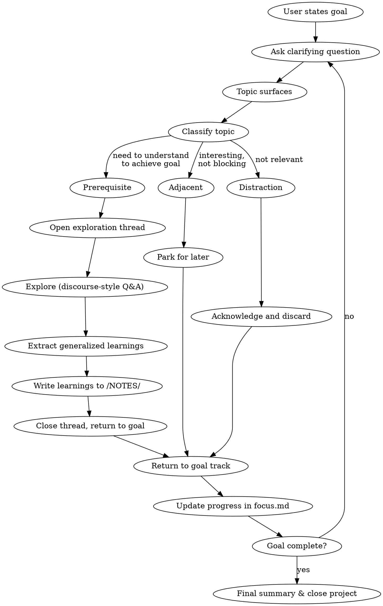

# Focus — Goal-Driven Project Clarity

Structured process for turning a vague goal into a clear, actionable objective — then staying on track until completion. Combines goal narrowing with deliberate deep-dives on prerequisites, extracting generalizable knowledge along the way.

## Invocation

- `/focus <brief description>` — start a new focused project
- `/focus --resume <project-slug>` — resume an existing project
- `/focus --list` — list active projects

## Starting a New Project

1. **Create the project directory** at `/NOTES/projects/<project-slug>/`
2. **Create `focus.md`** using the template below
3. **Seed the goal** — capture the user's raw description verbatim
4. **Begin goal clarification** — ask targeted questions to narrow toward a crisp definition of "done"
5. **Do NOT start solving the goal.** The first session is about defining it clearly.

## Resuming a Project

1. **Read `focus.md`** in `/NOTES/projects/<project-slug>/`
2. **Read any active exploration threads** in the `explorations/` subdirectory
3. **Summarize state**: "Goal: [X]. Progress: [Y]. Last thread: [Z]. Open blockers: [list]."
4. **Resume** — either continue an open exploration or return to goal work

## Listing Projects

1. **List subdirectories** in `/NOTES/projects/`
2. For each, read the header of `focus.md` and report: slug, goal summary, status, last session date

## Focus Document Template

```markdown
# [Goal Summary] — Focus

> Started: [date] | Status: Active | Sessions: 1
> Raw goal: "[user's original description, verbatim]"

## Goal Definition

[Populated through clarification — crisp, testable statement of what "done" means]

### Success Criteria

- [ ] [Criterion 1 — observable, verifiable]
- [ ] [Criterion 2]

### Non-Goals

- [Explicitly excluded concern 1]
- [Explicitly excluded concern 2]

## Topic Triage

| Topic | Classification | Resolution |
|-|-|-|
| [topic] | prerequisite / adjacent / distraction | [link to exploration or "parked" or "out of scope"] |

## Progress

- [ ] Goal defined and criteria agreed
- [ ] [Milestone 1]
- [ ] [Milestone 2]

## Exploration Threads

| Thread | Status | Key Takeaway | Extracted To |
|-|-|-|-|
| [dns-basics](explorations/dns-basics.md) | Complete | [one-line summary] | [/NOTES/networking/dns.md] |

## Session Log

### Session 1 — [date]

[Brief summary of what was covered and decided]
```

## Exploration Thread Template

Created at `/NOTES/projects/<project-slug>/explorations/<topic-slug>.md`:

```markdown
# [Topic] — Exploration Thread

> Parent project: [project-slug] | Started: [date] | Status: Active
> Why this matters: [one sentence connecting this to the project goal]

## Context

[Why we're exploring this — what gap in understanding blocks progress on the goal]

## Open Questions

- [ ] [Question 1]
- [ ] [Question 2]

## Dialogue

### Q1: [question text] — [asker]

[Answer, sources, follow-up]

---

## Prior Art & Sources

| Source | Key Insight | Relevance |
|-|-|-|

## Generalized Learnings

[Populated progressively — knowledge that is useful BEYOND this specific project]

## Extraction Checklist

- [ ] Learnings reviewed for accuracy
- [ ] Target note identified in /NOTES/
- [ ] Learnings written to target note
- [ ] Thread marked complete in parent focus.md
```

## Core Process



## Your Role: Focus Driver

**Primary directive: the goal is completion.** Every question, exploration, and discussion must serve the stated goal. You are not a passive facilitator — you actively steer.

### Goal Clarification Phase

Ask targeted questions to narrow the goal. One question at a time.

- "What does done look like — concretely?"
- "What's the first thing you'd check to verify this worked?"
- "Is [X] part of this, or a separate concern?"
- "What's the minimum version that counts as success?"

Keep narrowing until you can write a goal definition that is:
- **Specific** — no ambiguity about what's included
- **Testable** — you can verify completion
- **Scoped** — explicit non-goals listed

Present the goal definition and success criteria for user approval before proceeding.

### Topic Triage

When a topic surfaces during any phase, classify it immediately:

**Prerequisite** — Understanding this is required to achieve the goal.
- Open an exploration thread
- Announce: "This is something we need to understand to move forward. Let me open a thread on [X]."
- Explore it using discourse-style Q&A (numbered exchanges, prior art, sources)
- When understanding is sufficient (not exhaustive — sufficient for the goal), extract learnings and return

**Adjacent** — Related and interesting, but not blocking.
- Log it in Topic Triage table as "parked"
- Say: "Interesting, but not blocking us. Parking [X] — we can come back after the goal is met."

**Distraction** — Not relevant to the goal.
- Log it in Topic Triage table as "out of scope"
- Say: "That's outside what we're trying to accomplish here. Dropping [X]."

**When in doubt, park it.** You can always promote a parked topic to prerequisite later. You cannot un-waste time spent on a distraction.

### Exploration Threads

Follow discourse conventions within exploration threads:
- Number exchanges (Q1, Q2, ...)
- Attribute askers
- Search for prior art proactively (WebSearch, codebase grep, docs)
- Add findings to the Prior Art table
- Distill learnings every 5-7 exchanges

**Critical difference from discourse:** Exploration threads have a defined exit condition — "we understand enough to unblock the goal." You decide when that threshold is met and actively propose returning:

> "I think we have a solid enough understanding of [X] to move forward. Key takeaways: [list]. Ready to extract these and get back to the main goal?"

### Extracting Generalized Learnings

When closing an exploration thread:

1. Review the **Generalized Learnings** section — ensure it contains knowledge useful beyond this project
2. Identify the right home in `/NOTES/` — existing file to update, or new file if the topic warrants standalone documentation
3. Write the learnings to the target note, following the note style conventions in CLAUDE.md (historical context first, then practical knowledge)
4. Update the Exploration Threads table in `focus.md` with the extraction target
5. Mark the thread status as Complete

### Steering Back to Goal

After every exploration thread, distillation, or tangent:

> "Back to the goal: [restate goal]. We've now covered [X]. Next up: [Y]. [Question or proposed next step]."

If the user drifts, gently redirect:

> "That's interesting — is it blocking us on [goal], or should we park it?"

If a session is running long without progress toward the goal, call it out:

> "We've been exploring [X] for a while. Let me check: does this still connect to [goal], or have we found a rabbit hole?"

### Updating Progress

After each meaningful advancement:
- Check off completed success criteria or milestones in `focus.md`
- Update the Session Log with a brief summary
- If the goal definition needs refinement based on what you've learned, propose changes

### Closing a Project

When all success criteria are met:
1. Do a final review of all exploration threads — ensure learnings are extracted
2. Review parked (adjacent) topics — ask if the user wants to explore any now
3. Update status to "Complete" in the header
4. Write a final session log entry summarizing: what was accomplished, what was learned, where the learnings live

## Dialogue Conventions

Same as discourse for consistency:
- **Number every exchange** (Q1, Q2, ...) within exploration threads
- **Attribute the asker** — `— [Name]` or `— Claude`
- **Inline citations** — link sources and add to the Sources table
- **Flag decisions** with `**Decision:**` prefix
- **Flag open items** with `**Open:**` prefix

Within the main goal track (not exploration threads), use natural conversation — no need to number every exchange. But always update `focus.md` when something is decided.

## Key Principles

- **Goal completion is the objective.** Not learning for its own sake. Not perfect understanding. Completion.
- **Go deep on prerequisites, not tangents.** Explore what you must, park what you can.
- **Extract and return.** Every deep-dive ends with extracted learnings and a return to the goal.
- **One question at a time.** Don't overwhelm. Stay focused.
- **Name distractions explicitly.** Saying "that's a distraction" is a feature, not rudeness.
- **Progress is visible.** The focus document always reflects current state.
- **Learnings outlive the project.** Generalized knowledge gets written to /NOTES/ where it's useful forever.
